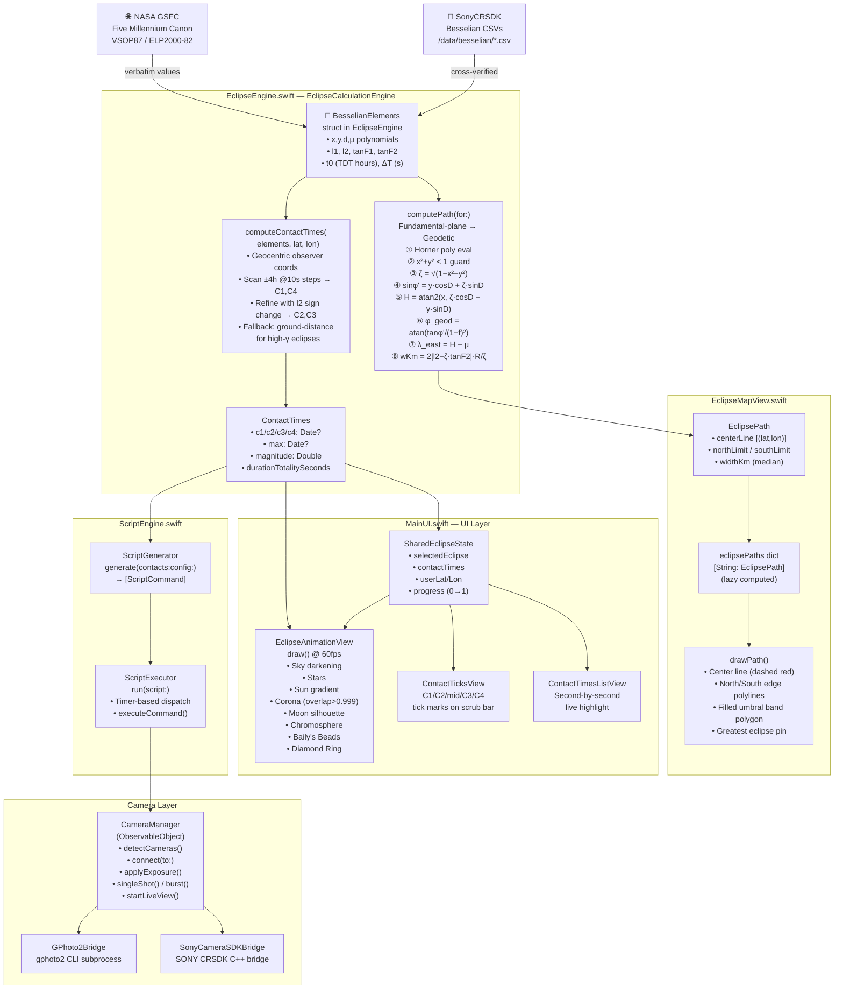
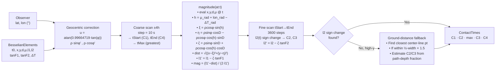
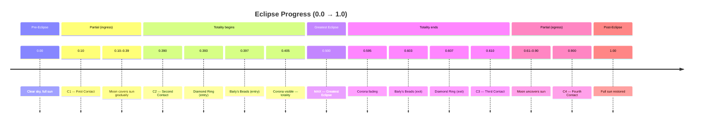
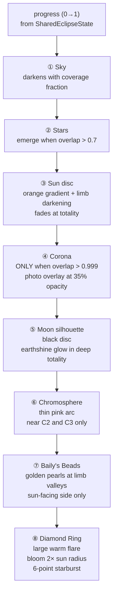

# 🌑 EclipseSwift — Eclipse Photography Tool

A macOS astronomy tool for planning and executing solar eclipse photography.  
Built with **Swift + AppKit + MapKit**, compiled directly with `swiftc` (no Xcode required).

> **GitHub**: https://github.com/vinodv2k/EclipseSwift  
> **Platform**: macOS 11+ · x86_64 · AppKit + MapKit + CoreLocation

---

## ✨ Features

| Feature | Description |
|---------|-------------|
| 🗺 **Interactive Eclipse Map** | Computed eclipse paths for 2024–2034 overlaid on MapKit |
| ⏱ **Contact Time Calculator** | Besselian-elements math gives C1/C2/C3/C4 for any lat/lon |
| 🎞 **Eclipse Simulation** | Full animated totality sequence with corona, Baily's Beads, Diamond Ring |
| 📷 **Camera Control** | Sony SDK + gPhoto2 camera detection, live view, exposure control |
| 📜 **Script Generator** | Auto-generate timed shoot sequences from contact times |
| 🌑 **Multi-Eclipse Support** | 2024 Apr 8 → 2034 Mar 20 (11 total + annular + hybrid) |

---

## 🚀 Build & Run

```bash
bash build.sh
```

Compiles all Swift sources, copies `Resources/` assets, generates `Info.plist`,
and launches the `.app` bundle automatically.

---

## 🏗 Architecture

```
Sources/EclipseApp/
├── UI/
│   └── MainUI.swift          ← Entire UI: window, sidebar, tabs, simulation (2955 lines)
├── Eclipse/
│   ├── EclipseEngine.swift   ← Besselian math, contact times, path computation
│   └── EclipseMapView.swift  ← MapKit overlay rendering
├── Camera/
│   ├── CameraManager.swift   ← Sony SDK + gPhoto2 abstraction
│   ├── GPhoto2Bridge.swift   ← gPhoto2 CLI bridge
│   └── SonyCameraSDKBridge.swift ← Sony CRSDK bridge
└── Script/
    └── ScriptEngine.swift    ← Photography script generation + execution
```

---

## 🔭 Calculation Architecture (Mermaid)

### End-to-End Data & Computation Flow



---

### Contact Time Computation Detail



---

### Eclipse Simulation Progress Timeline



---

### Rendering Layer Order (EclipseAnimationView)



---

## 📐 Key Formulas

### Fundamental-Plane → Geodetic (Espenak/Meeus)

```
ζ         = √(1 − x² − y²)
sin(φ')   = y·cos(D) + ζ·sin(D)          // geocentric latitude
H         = atan2(x,  ζ·cos(D) − y·sin(D))  // local hour angle (deg)
φ_geod    = atan(tan(φ') / (1−f)²)        // WGS-84 geodetic latitude
λ_east    = H − μ                          // east longitude (NOT μ − H)
w_km      = 2 · |l₂ − ζ·tanF₂| · 6378.137 / ζ
```

### Observer Magnitude

```
h      = μ_rad + λ_east_rad − ΔT·2π/86400
ξ      = ρ_cos · sin(h)
η      = ρ_sin·cos(D) − ρ_cos·cos(h)·sin(D)
ζ_obs  = ρ_sin·sin(D) + ρ_cos·cos(h)·cos(D)
dist   = √((x−ξ)² + (y−η)²)
l₁'    = l₁ − ζ_obs·tanF₁
mag    = (l₁' − dist) / (2·l₁')          // 0 = no eclipse, 1 = total
```

> Sign convention verified against `SonyCRSDK/src/eclipse/services/solar/EclipseCalculationService.cpp`

---

## 🗂 Eclipse Database (2024–2034)

| Date | Type | Greatest Eclipse | Max Duration | Width |
|------|------|-----------------|-------------|-------|
| 2024-04-08 | Total | 25.3°N 104.1°W | 4m 28s | 198 km |
| 2026-08-12 | Total | 65.2°N 25.2°W | 2m 18s | 294 km |
| 2027-08-02 | Total | 25.5°N 33.2°E | 6m 23s | 258 km |
| 2028-07-22 | Total | 15.6°S 126.7°E | 5m 10s | 230 km |
| 2029-01-26 | Partial | — | — | — |
| 2030-06-01 | Annular | 56.5°N 80.1°E | 5m 21s | 250 km |
| 2030-11-25 | Total | 43.6°S 71.2°E | 3m 44s | 169 km |
| 2031-05-21 | Annular | 8.9°N 71.7°E | 5m 26s | 152 km |
| 2031-11-14 | Hybrid | 0.6°S 137.6°W | 1m 08s | 38 km |
| 2032-05-09 | Annular | 51.3°S 7.1°W | 0m 22s | 44 km |
| 2033-03-30 | Total | 71.3°N 155.8°W | 2m 37s | 781 km |
| 2034-03-20 | Total | 16.1°N 22.2°E | 4m 09s | 159 km |

All Besselian elements sourced verbatim from **NASA GSFC Five Millennium Canon**
(Fred Espenak, VSOP87/ELP2000-82) and cross-verified against SonyCRSDK CSV data.

---

## 📚 References

- [NASA Five Millennium Canon of Solar Eclipses](https://eclipse.gsfc.nasa.gov/SEpubs/5MCSE.html)
- [NASA Solar Eclipse Search Engine](https://eclipse.gsfc.nasa.gov/SEsearch/SEsearch.php)
- [Meeus, *Astronomical Algorithms* 2nd ed., Ch. 54–55](https://www.willbell.com/math/mc1.htm)
- [Espenak — Besselian Elements](https://eclipse.gsfc.nasa.gov/SEcat5/beselm.html)
- SonyCRSDK `EclipseCalculationService.cpp` (internal reference implementation)

---

## 📄 License

Private repository — © 2026 vinodv2k. All rights reserved.
